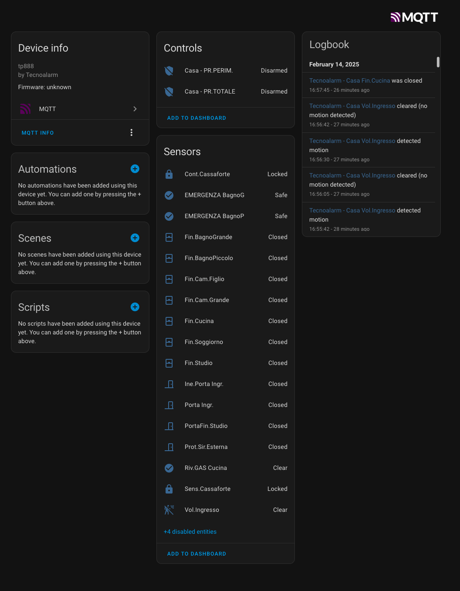

# MQTT script

This script exports data to MQTT and can be integrated with Home Assistant

## Prerequisites

Set up the `.env` file (as the `.env.example`) with all the required variables for the `pytcs` library and the MQTT broker.


### Docker Compose

A `docker-compose.yml` file is provided to start up the environment.

Build (only the first time): `docker compose build tecnoalarm`

Run: `docker compose up -d`

## Home Assistant 

MQTT window sensor and a (very basic) program configuration examples:

```yaml
mqtt:
  - binary_sensor:
      - name: "Room window"
        unique_id: room_window
        state_topic: "tecnoalarm/zones/room_window"
        value_template: "{{ 'ON' if value_json.status == 'OPEN' else 'OFF' }}"
        device_class: window
        device:
          identifiers: tecnoalarm
          name: Alarm
          manufacturer: TecnoAlarm
          model: TP10-42

  - alarm_control_panel:
      - name: Casa - PR.TOTALE
        unique_id: tecnoalarm_XXXXXXX_0_panel
        state_topic: tecnoalarm/programs/pr_totale/status
        value_template: 'triggereddisarmedarmed_away'
        command_topic: tecnoalarm/programs/pr_totale/status/set
        supported_features:
        - arm_away
        code_arm_required: 'True'
        code_disarm_required: 'True'
        payload_arm_away: 'ON'
        payload_disarm: 'OFF'
        device:
          identifiers: tecnoalarm
          name: Alarm
          manufacturer: TecnoAlarm
          model: TP10-42
```

In order to support more than one centrale, the variable `MULTIPLE_TCS` can be set to `True` and the topics will include the `serial` number as the example below:

```yaml
mqtt:
  - binary_sensor:
      - name: "Room window"
        unique_id: room_window
        state_topic: "tecnoalarm/<serial>/zones/room_window"
        value_template: "{{ 'ON' if value_json.status == 'OPEN' else 'OFF' }}"
        device_class: window
```

In alternative, Home Assistant MQTT Discovery can be enabled using the environment variable `MQTT_HA_DISCOVERY_PREFIX` (usually set to `homeassistant`). Doing so would would push all the Programs and Zones in a single device in the MQTT integration:



If you prefer to map devices manually, the mqtt container will print in the console every device in yaml format for an easy copy/paste in your configuration files.
